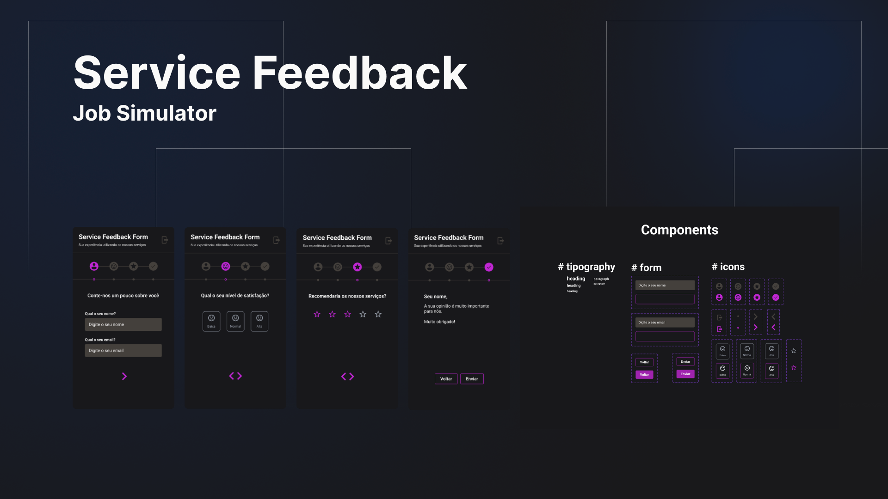

<h1 align="center"> Service Feedback - Refatoração </h1>

Em construção

Refatoração de todo projeto utilizando o React de forma simplificada

  <a href="#Tecnologias">Tecnologias</a>&nbsp;&nbsp;&nbsp;|&nbsp;&nbsp;&nbsp;
  <a href="#Projeto">Projeto</a>&nbsp;&nbsp;&nbsp;|&nbsp;&nbsp;&nbsp;
  <a href="#Refatoração">Refatoração</a>&nbsp;&nbsp;&nbsp;|&nbsp;&nbsp;&nbsp;

 

  

## Tecnologias

Esse projeto está sendo refatorado com as seguintes tecnologias:

- [HTML](https://developer.mozilla.org/pt-BR/docs/Web/HTML)
- [JavaScript](https://developer.mozilla.org/pt-BR/docs/Web/JavaScript)
- [React JS](https://pt-br.reactjs.org/)
- [Material UI](https://mui.com)
- [Node e NPM](https://nodejs.org/)
- [Vite](https://vitejs.dev/)

## Projeto

O Service Feedback é uma aplicação SPA ([Single Page Application](https://en.wikipedia.org/wiki/Single-page_application)) que exibe um formulário que o usuário possa expressar o seu nível de satisfação com um serviço/produto recebido.

### Requisitos funcionais

_O usuário preenche as informações necessárias_

1. Identificação
   1.1. Nome
   1.2. Email

2. Nível de satisfação
   2.1. Escolha entre 3 opções: Baixa, Normal e Alta

3. Recomendação
   3.1 Escolhe uma pontuação entre 1 e 5

Este componente deve ser um componente "rating" com estrelas de pontuação, e funcionar da seguinte forma:

- Caso o usuário selecionae mais de 1 estrela, as estrelas anteriores também devem ser selecionadas.

4. Componentes adicionais

4.1. Barra de navegação com ícones
Indicam em que parte da aplicação o usuário está. Deve ser um elemento que possui ícones indicativos que sofrem mudança visual conforme são selecionados.

4.2. Barra de progresso composto por uma linha horizontal e "bullets" ao longo da mesma, que são selecionados conforme a passagem dos componentes.

## Refatoração

### Análise preliminar

Verifiquei que o projeto não foi finalizado corretamente. Não está funcionando conforme os requisitos.
Notei também que há uma complexidade desnecessária no seu desenvolvimento (tanto a componentização quanto a aplicação de estilos), o que torna difícil a manutenção e escalabilidade.
A ideia é refatorar o projeto, eliminando a complexidade desnecessária adicionando código mais limpo,utilizando os recursos básicos do React.

_Até onde a aplicação funciona_

1. É possível inserir os dados e passar para o próximo componente;
2. É possível selecionar a opção e passar para o próximo componente;
3. Não é possível selecionar o nível satisfacão de forma adequada. Quando o usuário seleciona 1 estrela, as estrelas anteriores não são selecionadas;
   Também não é possível passar para o componente final de resumo.
4. Ambas as barras de navegação e progresso não estão mudando conforme o requisito.

## Decisões

Os componentes serão refeitos utilizando princípios base do React;
Utilizarei a biblioteca Material UI para simplificar o estilo e comportamento dos componentes.

## Layout

Utilizei o Figma para construção dos componentes e montagem do layout.

## Aprendizado

- Em construção.

---

Feito por [Anderson Vieira](https://linkedin/in/vieira-a)
